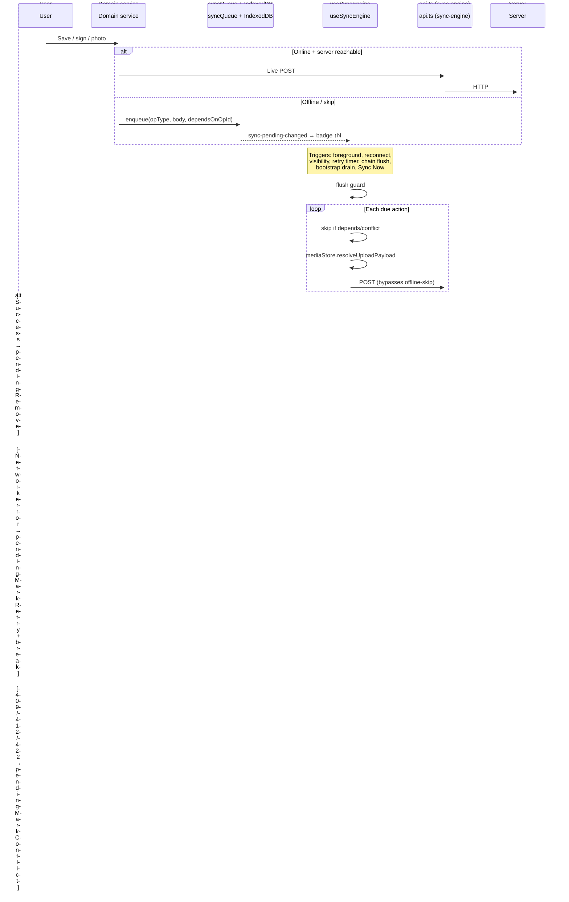

# Native offline sync investigation plan

**Date:** 2026-08-07  
**Reporter:** Juan Perez (Installer, native phone)  
**Symptoms from field test:**

| Symptom | Screenshot evidence |
|---------|---------------------|
| **10 pending uploads stuck 1+ hour** | Header `↑ 10 pending`; Sync Center shows queued items |
| **Login/logout does not clear queue** | Pending count persists across sessions |
| **Blue/teal banner while phone offline** | `10 changes queued — syncing now` with no usable network |
| **App attempts sync while offline** | Full-screen `Syncing…` overlay; flush loop continues |
| **Back online still won't upload** | Pending count unchanged after reconnect |

**Related prior work on `main`:** field-test batch 3 (#105), offline-sync-ui-fixes (#103), sync-flush P1/P2, upload-before-bootstrap gate, sync-now-deadlock fix, native-false-offline fix.

---

## Executive summary

The reported behavior is **not a single bug** — it is a stack of interacting issues in connectivity gating, UI messaging, dependency chains, and bandwidth competition. The phone shows "syncing" while the engine is either (a) blocked, (b) failing silently with backoff, or (c) spinning on network errors without draining the queue.

**Most likely root causes (ranked):**

1. **Misleading UI** — teal banner says "syncing now" when work is only *queued*, not actively uploading.
2. **Pending uploads suppress offline mode** — with `pendingCount > 0`, server-unreachable does not activate offline mode, so flush keeps trying even when POSTs cannot succeed.
3. **Dependency deadlocks** — `SIGNATURE_SUBMIT` / media uploads blocked behind unresolved `RUN_CREATE` / `RUN_COMPLETE`.
4. **Bootstrap competes with uploads** — after 5 min timeout, prefetch GET storm may starve POST bandwidth.
5. **Radio `null` treated as online** — flush fires before Capacitor reports disconnected state.
6. **Hidden failures** — conflicts, backoff, or dropped ops (20 retries) not surfaced clearly to installer.

---

## Architecture map

### Pending count source

```
IndexedDB pending_actions row count
  → useSyncEngine.refreshPending()
  → SyncStatusBadge "↑ N pending"
  → syncConnectivityGuard.setSyncConnectivityPendingCount(N)
```

**Important:** Count includes `pending`, `uploading`, `failed`, and **conflict** rows. Conflicts still increment the badge but are skipped during flush.

Key files:
- `src/hooks/useSyncEngine.ts` — `refreshPending`, flush loop
- `src/services/localDB.ts` — `pendingCount()`, `pendingGetDue()`, backoff schedule
- `src/components/ui/SyncStatusBadge.tsx` — header badge

### Banner / overlay stack (native)

| UI element | When shown | Color |
|------------|------------|-------|
| `NativeLifecycleBanner` | `foreground-sync` phase + not offline + (syncing OR pending > 0) | Teal — **"N changes queued — syncing now"** |
| `OfflineModeBanner` | `isOfflineModeActive()` (radio off, manual, or unreachable *without* upload suppression) | Amber |
| `SyncBusyOverlay` | `sync-engine:syncing` event during active flush | Full-screen spinner |
| Bootstrap progress | `offlineBootstrapService` prefetch in progress | Blue — "Downloading field data…" |

Key insight: **Teal banner ≠ offline banner.** Teal appears when connectivity is not `"offline"` even if POSTs are failing. Amber offline banner is **hidden** while `pendingCount > 0` (upload suppression).

### Connectivity layers

```
Layer 1: Capacitor Network (radio)     → hasNetworkSignal()
Layer 2: /health ping (30s)            → serverReachable
Layer 3: Real API outcomes             → api-server-reachable / unreachable events
Layer 4: OfflineModeContext            → isOfflineModeActive()
Layer 5: Upload suppression            → shouldSuppressUnreachableOffline()
```

Flush gate (`useSyncEngine.flush`):
```typescript
if (isOfflineModeActive() || !hasNetworkSignal()) return;
// Note: null radio → hasNetworkSignal() === true
```

Sync-engine writes **bypass** offline fast-skip and circuit breaker in `api.ts` — only stopped by flush gate above.

### Sync lifecycle



---

## Hypothesis matrix (symptom → cause → verification)

| # | Symptom | Hypothesis | How to verify on phone |
|---|---------|------------|------------------------|
| H1 | Teal "syncing now" while offline | Banner only checks `connectivity !== "offline"`; radio may still read connected briefly; text shown even when `syncing === false` | Airplane mode → watch banner vs Sync Center chips ("Has signal", "Sending changes now") |
| H2 | Full-screen Syncing overlay offline | Flush started before radio dropped; or chain-flush/retry timer firing | Debug panel / Sync Center API log — look for sync-engine POSTs after airplane mode |
| H3 | 10 pending stuck 1 hr | Dependency chain blocked (`dependsOnOpId`); or all ops in backoff; or conflicts hidden in count | Sync Center → expand each row → Technical details; check opType + last error |
| H4 | Login/logout no effect | Expected — queue is IndexedDB per device, not session. 401 mid-flush pauses until re-auth | Re-login → tap Sync Now → check if flush resumes |
| H5 | Back online no upload | RUN_CREATE never mapped temp ID; bootstrap starves bandwidth; health ping OK but POST timeout loop | Export support bundle; check `pendingGetDue` nextRetryAt; pause bootstrap test |
| H6 | Count varies (10 vs 22 vs 110) | Different sessions/queues; media blobs each count as separate ops; bootstrap download separate from upload count | Compare Sync Center queue list vs header badge vs telemetry panel |

---

## Investigation phases

### Phase 0 — Reproduce with diagnostics (1 session on phone)

**Setup:** Juan Perez installer, LAN API (`VITE_API_BASE`), debug FAB enabled.

1. **Baseline online:** Note pending count = 0.
2. **Create offline work:** Airplane mode → complete 1 run with 2–3 photos + customer sign-off.
3. **Observe offline:** Confirm amber offline banner OR teal banner (record which).
4. **Reconnect:** Turn off airplane mode → wait 5 min without touching app.
5. **Sync Center capture:**
   - Pending queue (all rows, expand Technical details)
   - Connectivity chips state
   - API debug log (last 20 sync-engine entries)
   - Export support bundle
6. **Tap Sync Now** → record whether count drains.
7. **If stuck:** Leave 30 min → re-check backoff / flush markers in diagnostics.

**Pass criteria for repro:** Pending count > 0 for 15+ min while "Has signal" + "Server reachable" both true.

### Phase 1 — Read queue state (dev, from support bundle or USB debug)

Inspect IndexedDB `pending_actions`:

| Field | What to look for |
|-------|------------------|
| `opType` | RUN_CREATE, RUN_COMPLETE, SIGNATURE_SUBMIT, ASSET_DOCUMENT_LINK_UPLOAD, etc. |
| `dependsOnOpId` | Non-null → blocked behind another op |
| `conflictDetected` | true → user must resolve in Sync Center |
| `status` | `uploading` stuck → killed mid-flush |
| `nextRetryAt` | Future timestamp → in backoff (5s → 15m) |
| `retryCount` | ≥ 20 → moved to `dropped_actions` |
| `lastError` / diagnostics | Network vs 422 vs timeout |

Also check `mediaStore` filesystem refs in payload — corrupt/missing file → permanent retry.

### Phase 2 — Code-path audit (already partially done)

Priority files:

| File | Audit focus |
|------|-------------|
| `useSyncEngine.ts:215-220` | `hasNetworkSignal()` — treat `null` as unknown, not online |
| `useSyncEngine.ts:640-643` | Flush gate — add explicit server reachability check option |
| `NativeLifecycleBanner.tsx:13-24` | Don't say "syncing now" unless `syncing === true` |
| `syncConnectivityGuard.ts` | Upload suppression hides offline UX — reconsider for true radio-off |
| `bootstrapUploadGate.ts` | 5 min timeout then bootstrap runs — extend or block bootstrap while uploads pending |
| `signatureService.ts` | Dependency chain RUN_CREATE → RUN_COMPLETE → SIGNATURE |
| `api.ts:231-243` | Sync-engine bypass — should respect radio-off even if pending > 0 |

### Phase 3 — Targeted fixes (proposed, after Phase 0–1 confirm)

#### Fix A — Stop sync attempts when truly offline (P0)

- `hasNetworkSignal()`: return `false` when native network is `null` until first Capacitor status (or pessimistic default offline).
- Do **not** suppress offline mode when `nativeConnected === false` even if pending > 0.
- Halt flush triggers (chain flush, retry timer, visibility) when radio is off.
- Sync-engine writes: still allow queue, but no HTTP until radio confirmed.

#### Fix B — Honest banner copy (P0)

| State | Message |
|-------|---------|
| Radio off | Amber: "Offline — N changes waiting" |
| Radio on, flush active | Teal: "Syncing N changes…" |
| Radio on, pending, not flushing | Teal: "N changes waiting to upload" (not "syncing now") |
| Server unreachable + pending | "N changes queued — will retry when server responds" |

#### Fix C — Unblock stuck queues (P1)

- Sync Center: show **block reason** per row ("Waiting for run create", "In backoff until 13:45", "Conflict — tap to resolve").
- Surface `dependsOnOpId` chain visually (ordered list).
- On reconnect: `pendingResetRetrySchedule()` + force flush head-of-chain op first.
- If RUN_CREATE failed 422: show actionable error (blocking issues) not silent skip.

#### Fix D — Upload vs bootstrap priority (P1)

- Do not start bootstrap prefetch until upload queue empty OR user explicitly pulls to refresh.
- Increase `waitForActiveUploadDrain` timeout OR remove timeout entirely when pending media ops exist.
- Pause bootstrap on `sync-engine:syncing`.

#### Fix E — Stuck state recovery (P2)

- Detect flush storm (`queue_flush_start` > N per minute) → backoff global flush 5s.
- Reset `uploading` → `pending` on app foreground (already partial via `pendingResetRetrySchedule`).
- Login: after token refresh, dispatch `sync-request-flush-now` (verify this path).

---

## Existing debug tools (use during investigation)

1. **Header sync badge** → Sync Center (`src/features/sync/SyncCenterPage.tsx`)
2. **Sync Now button** in Sync Center
3. **Connectivity chips** — Has signal / Server reachable / Sending changes
4. **Support bundle export** — full queue + connectivity snapshot
5. **Debug FAB** (bug icon) → API log, pending count
6. **`window.__offlinePerf`** — flush start/end markers

---

## Recommended fix order

| Priority | Work | Unblocks |
|----------|------|----------|
| **P0** | Phase 0 repro + support bundle from stuck device | Know exact queue composition |
| **P0** | Fix A — no HTTP flush when radio off | "Sync while offline" bug |
| **P0** | Fix B — honest banner copy | Installer trust / confusion |
| **P1** | Fix C — dependency/backoff visibility + chain unblock | Stuck 10 pending |
| **P1** | Fix D — bootstrap defers to uploads | Upload starvation |
| **P2** | Fix E — flush storm debounce | Performance / battery |

---

## Retest checklist (after fixes)

### Phone — offline upload drain

1. Airplane mode → complete run with 2 photos + sign-off → header shows pending, **amber offline banner**, no "syncing now".
2. Re-enable network → teal "Syncing…" → count drains to 0 within 2 min on good LAN.
3. Sync Center shows 0 pending, 0 conflicts.
4. Web PM view shows Complete for that asset.

### Phone — stuck recovery

1. If server returns 422 on RUN_COMPLETE (blocking issue) → Sync Center shows clear error, not infinite pending.
2. Login/logout with pending work → queue preserved, flush resumes after login.

### Phone — bootstrap vs upload

1. Reconnect with 10+ pending → uploads complete before "Downloading field data" progress appears.

---

## Branch plan

| Branch | Scope |
|--------|-------|
| `cursor/native-offline-sync-investigation-cd21` | This plan + Phase 0 instrumentation |
| `cursor/native-offline-flush-gate-cd21` | Fix A — radio-off flush gate |
| `cursor/native-sync-banner-honesty-cd21` | Fix B — banner copy + conditions |
| `cursor/native-sync-unblock-cd21` | Fix C + D — dependency UX + bootstrap priority |

---

## References

- `docs/FIELD_TEST_FINDINGS_2026-08-03.md` — original stuck queue / flush storm findings
- `docs/FIELD_TEST_ROUND2_INVESTIGATION_2026-08-03.md` — round 2 details
- `src/hooks/useSyncEngine.ts` — central sync engine
- `src/services/bootstrapUploadGate.ts` — upload-before-bootstrap
- `src/utils/syncConnectivityGuard.ts` — upload suppression logic
